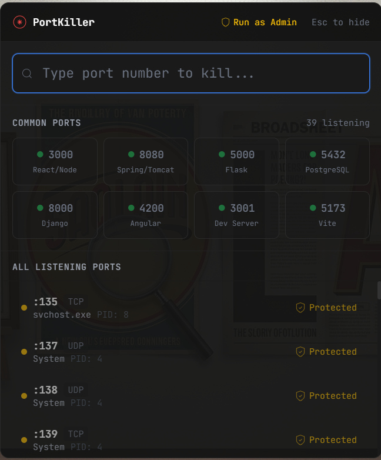
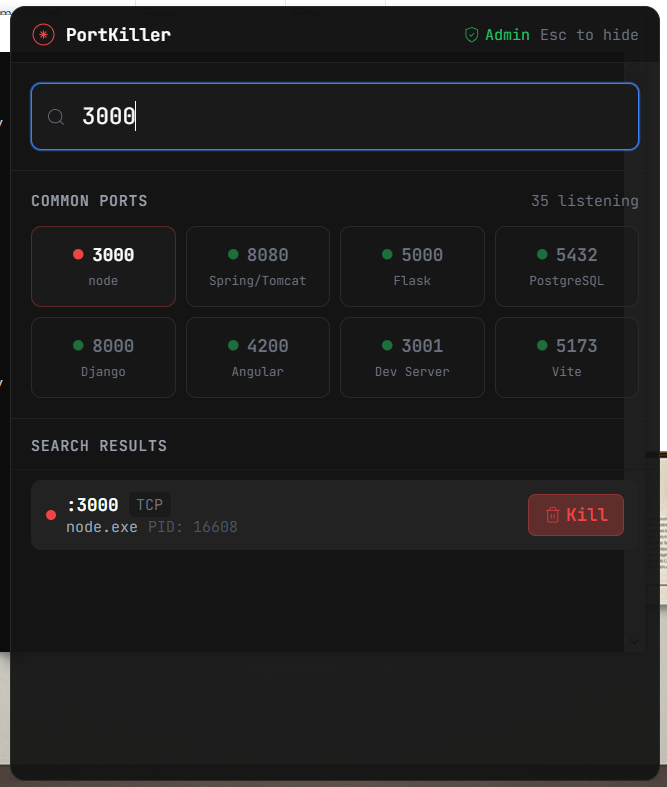

# PortKiller

A fast Windows utility to visualize and kill processes blocking specific ports. Built with Tauri, Rust, and Preact.

## Screenshots

<p align="center">
  
  
</p>

## Features

- Global hotkey (Alt+P) to show/hide overlay
- Live port scanning using Windows API
- Quick kill via port number input
- Common ports grid (3000, 8080, 5000, 5432, 8000, 4200, 5173)
- System tray integration
- Protected system process detection
- Admin elevation support for killing services

## Installation

Download the latest installer from [Releases](https://github.com/Razee4315/portkiller/releases):

- `PortKiller_x.x.x_x64-setup.exe` - NSIS installer (recommended)
- `PortKiller_x.x.x_x64_en-US.msi` - MSI installer

Or use the portable version with `WebView2Loader.dll` in the same folder.

## Usage

| Action | Method |
|--------|--------|
| Show/Hide | Press `Alt+P` or click system tray icon |
| Kill by port | Type port number, press `Enter` |
| Kill from list | Click the `Kill` button |
| Hide window | Press `Esc` |
| Run as Admin | Click `Run as Admin` button for elevated privileges |

## Requirements

- Windows 10/11 (x64)
- Microsoft Edge WebView2 Runtime (auto-installed)

## Building from Source

### Prerequisites

- [Node.js](https://nodejs.org/) (v18+)
- [Rust](https://rustup.rs/) (stable)
- [Tauri CLI](https://tauri.app/)

### Build

```bash
npm install
npm run tauri build
```

Output will be in `src-tauri/target/release/bundle/`.

## Tech Stack

- **Backend**: Rust + Tauri
- **Frontend**: Preact + TypeScript + Tailwind CSS
- **Port Detection**: netstat2 crate (Windows API)
- **Process Management**: sysinfo + Windows API

## Author

**Saqlain Razee**
- GitHub: [@Razee4315](https://github.com/Razee4315)
- LinkedIn: [saqlainrazee](https://www.linkedin.com/in/saqlainrazee/)
- Email: saqlainrazee@gmail.com

## License

MIT
