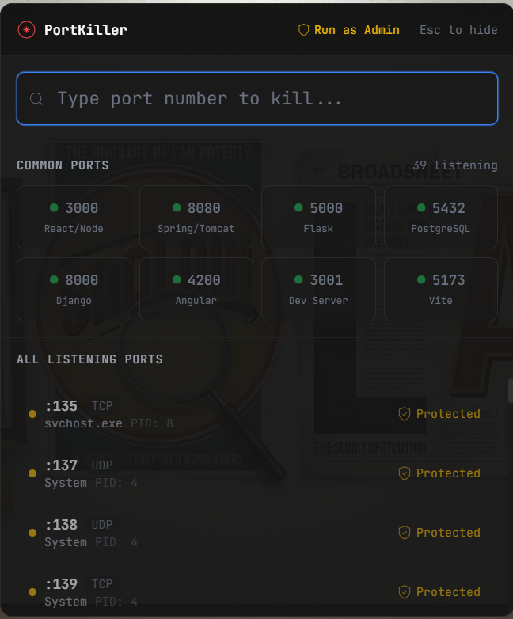
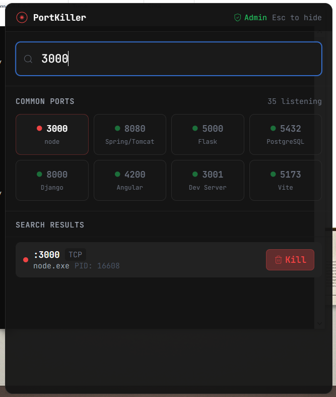

<div align="center">


# PortKiller

**Keyboard-driven port process killer for developers**

Find and kill processes blocking your ports in seconds.

[](https://github.com/Razee4315/portkiller/releases)
[](https://github.com/Razee4315/portkiller/actions)
[](LICENSE)

**Windows**

</div>

---

## Why PortKiller

Port conflicts kill momentum.

A stuck port means opening Task Manager, searching for the process, figuring out which one to kill, and hoping you got the right one. That friction adds up when you're juggling multiple dev servers.

PortKiller removes that gap.

Press `Alt+P` and an overlay appears instantly. Search, select, kill. No mouse needed, no context switching. You stay in flow and get back to coding.

---

## Overview

PortKiller is a lightweight, always-ready Windows utility that shows which processes are using your ports and lets you kill them with a keystroke. It runs quietly in your system tray and appears only when you need it.

<p align="center">
  
  
</p>

---

## Features

- **Global Hotkey** — `Alt+P` to show/hide from anywhere
- **Keyboard Navigation** — Arrow keys or vim-style `j/k`, fuzzy search
- **Command Palette** — `kill 3000`, `kill 3000-4000`, `admin`, `refresh`
- **Range Search** — Type `3000-4000` to filter to a port range
- **Pinned Ports** — Press `p` to pin favorites; they stick to the top
- **Protocol Filter** — One-click toggle for All / TCP / UDP
- **Public Binding Badge** — Spot ports bound to `0.0.0.0` instantly
- **Multi-Select** — `Ctrl+Click` or "select all from this PID" for bulk kill
- **Real-Time Updates** — Green/red highlighting for port changes
- **Process Details** — Double-click for memory, CPU, quick actions
- **Copy as Command** — Copy `taskkill` / `Stop-Process` for terminal use
- **Customizable Ports** — Configure your common dev ports
- **Admin Elevation** — One-click restart with elevated privileges

---

## Installation

Download the latest release:

- **Windows**: `.exe` (recommended), `.msi`

macOS and Linux support is not planned (Windows-specific utility).

---

## Usage

### Keyboard Shortcuts

| Shortcut | Action |
|----------|--------|
| `Alt+P` | Show/hide overlay |
| `↑/↓` or `j/k` | Navigate list |
| `Enter` | Kill selected process (twice to confirm) |
| `p` | Pin/unpin selected port |
| `Ctrl+C` | Copy selected `port:pid` |
| `Ctrl+A` | Select all visible ports |
| `Ctrl+Click` | Multi-select |
| `Esc` | Clear search / cancel / hide window |
| `/` | Focus search |
| `?` | Keyboard cheatsheet |

### Commands & Search

Type these directly in the search bar:

- `kill <port>` — Kill process on a specific port
- `kill 3000-4000` — Select every port in a range for bulk kill
- `3000-4000` — Filter the list to ports in that range
- `admin` — Restart with elevated privileges
- `refresh` — Refresh the port list
- `export json` / `export csv` — Copy port data to clipboard
- `clear` — Clear search and selection

---

## Development

### Requirements

- Node.js 18+
- Rust 1.70+
- Tauri system dependencies

### Run Locally

```bash
git clone https://github.com/Razee4315/portkiller.git
cd portkiller
npm install
npm run tauri dev
```

### Build

```bash
npm run tauri build
```

---

## License

This project is licensed under the **MIT License**. See [LICENSE](LICENSE) for details.

---

## Author

**Saqlain Razee**

- GitHub: https://github.com/Razee4315
- LinkedIn: https://linkedin.com/in/saqlainrazee
