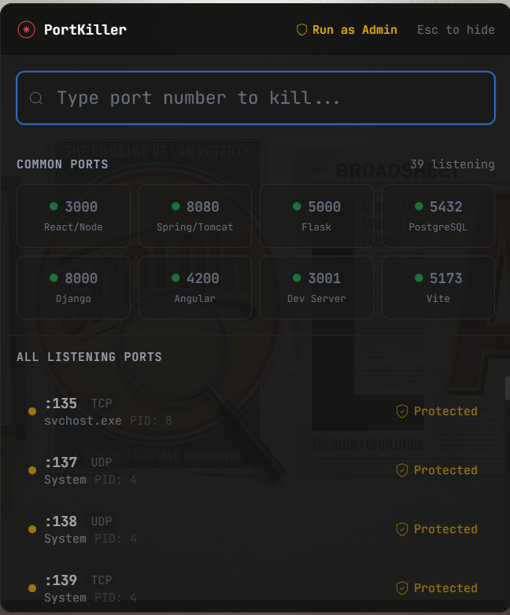
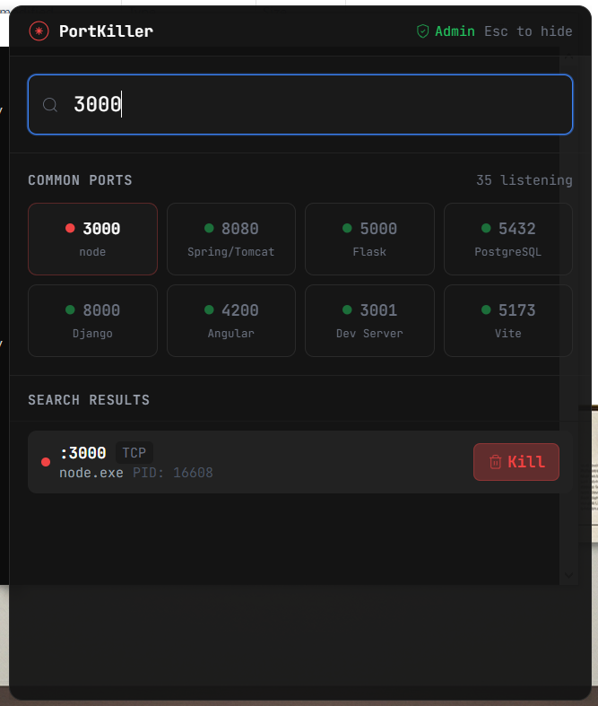

<div align="center">


# PortKiller

**Keyboard-driven port process killer for developers**

Find and kill processes blocking your ports in seconds.

[](https://github.com/Razee4315/portkiller/releases)
[](https://github.com/Razee4315/portkiller/actions)
[](LICENSE)

**Windows**

</div>

---

## Why PortKiller

Port conflicts kill momentum.

A stuck port means opening Task Manager, searching for the process, figuring out which one to kill, and hoping you got the right one. That friction adds up when you're juggling multiple dev servers.

PortKiller removes that gap.

Press `Alt+P` and an overlay appears instantly. Search, select, kill. No mouse needed, no context switching. You stay in flow and get back to coding.

---

## Overview

PortKiller is a lightweight, always-ready Windows utility that shows which processes are using your ports and lets you kill them with a keystroke. It runs quietly in your system tray and appears only when you need it.

<p align="center">
  
  
</p>

---

## Features

- **Global Hotkey** — `Alt+P` to show/hide from anywhere; change it in Settings
- **Keyboard Navigation** — Arrow keys or vim-style `j/k`, fuzzy search, or just start typing a port number
- **Which process is which** — Each row shows the command line, so five `node.exe` rows are told apart by what they are running
- **Command Palette** — `kill 3000`, `kill 3000-4000`, `admin`, `refresh`, with suggestions as you type
- **Range Search** — Type `3000-4000` to filter to a port range
- **Pinned Ports** — Press `p` to pin favorites; they stick to the top
- **Protocol Filter** — One-click toggle for All / TCP / UDP
- **Public Binding Badge** — Spot ports bound to `0.0.0.0` instantly
- **Multi-Select** — `Ctrl+Click`, `Space`, or "select all from this PID" for bulk kill
- **Safe Kills** — Every kill takes two presses, the backend re-checks the process before terminating it, and the result tells you whether the port was actually freed
- **Kill Process Tree** — Take a process down together with its children
- **Never-Kill List** — Mark your own processes as protected
- **Real-Time Updates** — Newly opened ports are highlighted
- **Process Details** — Double-click for memory, CPU, command line, quick actions
- **Copy as Command** — Copy `taskkill` / `Stop-Process` for terminal use
- **Customizable Ports** — Configure your common dev ports
- **Admin Elevation** — One-click restart with elevated privileges
- **Start with Windows** — Optional; launches quietly into the tray
- **Auto-Update** — Checks GitHub Releases at launch (can be turned off) and asks before installing

---

## Installation

Download the latest release:

- **Windows**: `.exe` (recommended), `.msi`

macOS and Linux support is not planned (Windows-specific utility).

---

## Usage

### Keyboard Shortcuts

| Shortcut | Action |
|----------|--------|
| `Alt+P` | Show/hide overlay (configurable in Settings) |
| `0`–`9` | Start typing a port number from anywhere |
| `↑/↓` or `j/k` | Move through the list |
| `Enter` or `Delete` | Kill the highlighted process (twice to confirm) |
| `p` | Pin/unpin the highlighted port |
| `h` | Open kill history |
| `Ctrl+C` | Copy the highlighted `port:pid` |
| `Ctrl+A` | Tick every visible killable port |
| `Space` | Tick the highlighted row for a bulk kill |
| `Ctrl+Click` / `Shift+Click` | Tick one row / a range of rows |
| `F5` / `Ctrl+R` | Refresh port list |
| `Esc` | Cancel, close, clear search, then hide |
| `/` | Focus search |
| `?` | Keyboard cheatsheet |

Single-key shortcuts only fire while the port list has the keyboard. They are ignored while you type in a field or a dialog is open.

### Commands & Search

Type these directly in the search bar:

- `<port>` or `kill <port>` — Kill the process on that port (press Enter twice)
- `kill 3000-4000` — Select every port in a range for bulk kill
- `kill all` — Select every killable port currently in the list
- `pin <port>` / `unpin <port>` / `unpin all` — Manage pinned ports
- `3000-4000` — Filter the list to ports in that range
- `admin` — Restart with elevated privileges
- `refresh` — Refresh the port list
- `export json` / `export csv` — Copy the visible ports to the clipboard
- `history`, `settings`, `help` — Open the matching panel
- `clear` — Clear search and selection

---

## Development

### Requirements

- Node.js 20+
- Rust (stable)
- Tauri system dependencies

### Run Locally

```bash
git clone https://github.com/Razee4315/portkiller.git
cd portkiller
npm install
npm run tauri dev
```

### Test

```bash
npm test
```

### Build

```bash
npm run tauri build
```

---

## License

This project is licensed under the **MIT License**. See [LICENSE](LICENSE) for details.

---

## Author

**Saqlain Razee**

- GitHub: https://github.com/Razee4315
- LinkedIn: https://linkedin.com/in/saqlainrazee
